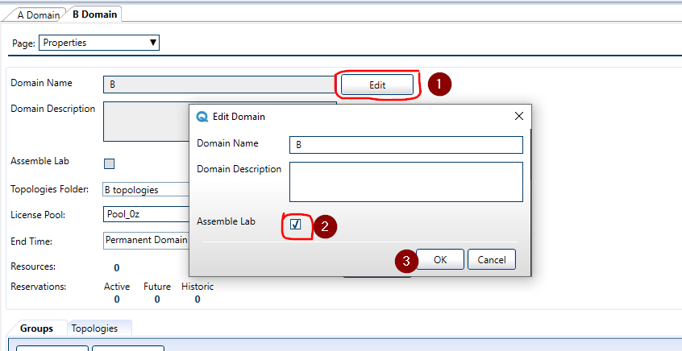

# Configure an Assembly Lab domain

:::note 
Once a domain has been configured as an assembly lab domain, do not try to change it back to a non assembly lab domain. Assembly Lab domains have a different set of rules for resource management and blueprint resolution which are not compatible with standard domain operation.
:::

To set a domain to be an Assembly Lab domain, open the [domain's properties page in Resource Management Client](../../../cloudshell-identity-management/cloudshell-domains/domains-window.md)

Press Edit next to the domain name

Tick the checkbox Assemble Lab and press ctrl+S

