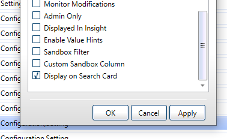

# Resource Search Customizations

Setup Cloudshell to show an attribute directly on search results

## Steps:

[Configure an attribute](../../../admin/setting-up-cloudshell/inventory-operations/resource-data-modeling-for-1st-gen-shells/attributes.md) to have the rule *Display On Search Card*

