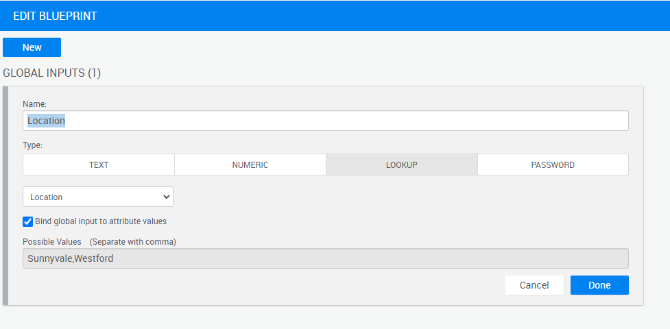

# Bind global input to an attribute

You can bind a global input with a lookup attribute. 

When you add or remove values from the lookup attribute, users who reserve the blueprint will be able to choose only from the values in that attribute.

**How to set it up**

1. Open [blueprint properties](./blueprint-properties.md)
2. Go to [inputs](./add-user-inputs.md)
3. In your global input, select the appropriate attribute and tick the "bind global input to attribute values" checkbox
