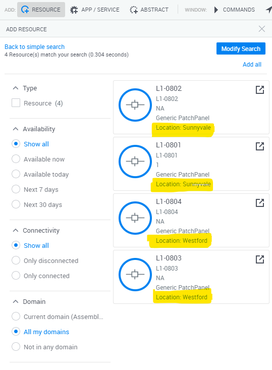
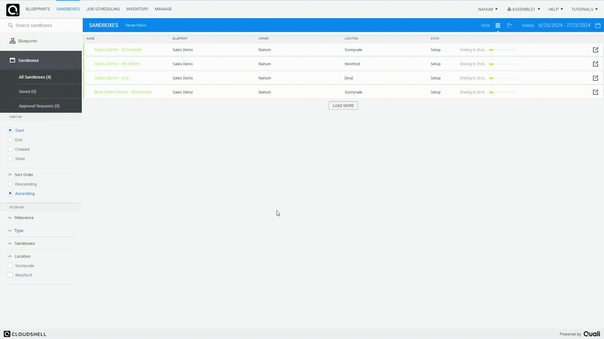

What's New in Version 2024.1
============================

## Features and enhancements

This release includes the following features and enhancements.

### Assembly Lab

A radically different mode of operation for CloudShell is now available!

- Manage devices on a part by part basis
    - Move sub resources from one device to another
    - Solve abstracts using parts from different devices

- Sandboxes can be partially solved by algorithm and partially by human involvement
    - Select solutions for abstract requests
    - Change solutions

#### For more information on Assembly lab, follow these links

- [Assembly Lab Overview](../admin/setting-up-cloudshell/cloudshell-configuration-options/assembly-lab/index.md)
- [Configure an Assembly Lab domain](../admin/setting-up-cloudshell/cloudshell-configuration-options/assembly-lab/configure-assembly-lab-domain.md)

### Capabilities

CloudShell's RBAC implementation, you can now associate user groups with capability sets.
Each capability set can specifically allow or block certain capabilities, overriding the defaults provided by the group role.

[Read more here](../admin/setting-up-cloudshell/cloudshell-configuration-options/capabilities/index.md)

### Display attributes in Resource Search directly on cards

[Configure specific attributes](../admin/setting-up-cloudshell/cloudshell-configuration-options/resource-search-customizations.md) to appear directly on resource search results.

### Filter sandboxes by user input and display the user input in Sandboxes Dashboard

- Configure an attribute to be displayed in sandbox dashboard
- Show only sandboxes which passed a particular value

[For more details](../admin/setting-up-cloudshell/cloudshell-configuration-options/customizing-sandboxes-dashboard.md)

### Minimum Lead Time

Configure a domain to set a minimum lead time for reserving Sandboxes.
When configured, sandboxes can only be ordered for a future date.

To configure it, set MinimumLeadTimeMinutes using [this](../api-guide/cs-admin-rest-api/edit-domain.md) API call.